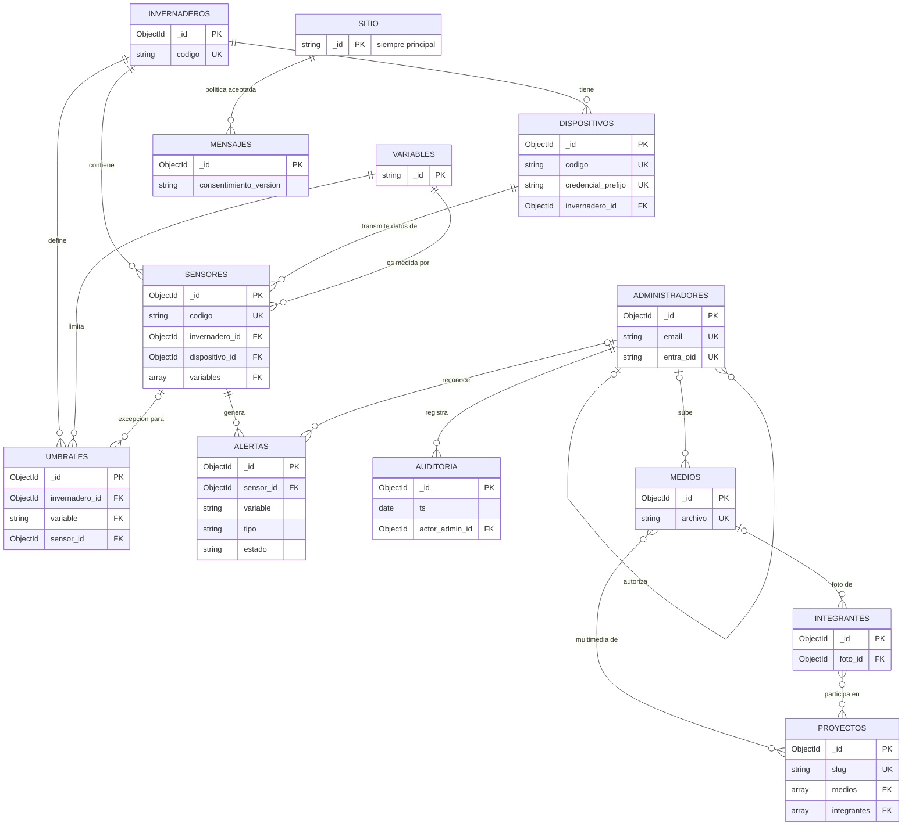

# Modelo de datos — MongoDB 7.0

Base: `semillero` · Versión de esquema: **1** (`_meta.esquema`)
Scripts: `mongo-init/01-colecciones.js`, `02-roles-usuarios.js`, `03-semillas.js`

## Qué vive dónde

| Dato | Dónde | Por qué |
|---|---|---|
| Lecturas de sensores (series de tiempo) | **InfluxDB** existente | Node-RED ya escribe ahí; es su especialidad |
| Catálogo: invernaderos, sensores, variables, dispositivos | **MongoDB** | Configuración editable desde el panel |
| Umbrales y alertas | **MongoDB** | Configuración + estado derivado |
| Contenido del sitio, equipo, proyectos, mensajes | **MongoDB** | Documentos editables (CMS) |
| Archivos (imágenes, video, PDF) | **Disco** (`uploads/`) | Mongo guarda solo los metadatos en `medios` |
| Métricas de uso del sitio (RF-27) | Logs del proxy / analítica | No se modela en Mongo |
| Sesiones de login | Cookie firmada (JWT) | Sin estado en la BD |

El puente entre Mongo e Influx es `sensores.codigo` + `sensores.influx` (bucket, measurement, tags): la API sabe qué consultar en Influx para cada sensor.

## Diagrama de relaciones

Las relaciones son **referencias por `_id`** (Mongo no las hace cumplir): la API es responsable de la integridad, por ejemplo no borrar un medio que sigue usado por un proyecto.

## Colecciones

### Invernadero y sensores

**`invernaderos`** — un documento por invernadero. `codigo` único (`invernadero-1`). Permite crecer a varios invernaderos sin rediseño (RNF-02).

**`variables`** — catálogo abierto de magnitudes (RF-13). El `_id` es el código estable que usan Node-RED, MQTT e Influx (`temperatura`, `humedad_relativa`, `ph`). `rango_valido` sirve para que la ingesta descarte lecturas físicamente imposibles, como las del sensor defectuoso que se retiró. Agregar CO₂ o luminosidad es insertar un documento.

**`dispositivos`** — quien se autentica contra la API de ingesta (RF-14). Hoy es el gateway Node-RED; mañana puede ser cada nodo. La API key tiene la forma `sk_<prefijo>_<secreto>`: el prefijo se guarda en claro para encontrar el dispositivo y el secreto solo como hash (argon2/bcrypt). Revocar = `activo: false`.

**`sensores`** — catálogo físico. Referencia su invernadero, el dispositivo por el que llegan sus datos y las variables que mide. `estado: "retirado"` hace que la ingesta ignore sus lecturas sin borrar su historia. `ultimo_reporte` + `intervalo_esperado_s` permiten detectar sensores caídos (RF-27).

### Umbrales y alertas

**`umbrales`** — mín/máx por variable (RF-17), con al menos uno de los dos. Dos niveles:
- `sensor_id: null` → aplica a todos los sensores del invernadero.
- `sensor_id: X` → excepción para ese sensor.

Al evaluar, la API busca primero el umbral del sensor y, si no existe, el general. Índice único sobre `(invernadero_id, variable, sensor_id)`.

**`alertas`** — historial de eventos. Tipos: `max`, `min`, `sin_reporte`. Un índice único parcial garantiza **como máximo una alerta activa por sensor/variable/tipo**: la ingesta inserta al salir del umbral (y notifica), actualiza `ultimo_valor` mientras siga fuera, y pasa a `resuelta` al volver. Así se envía un correo al entrar y uno al salir, no uno por lectura. `umbral` guarda una copia de los límites vigentes al disparar.

### Contenido del sitio

**`sitio`** — documento único (`_id: "principal"`, forzado por el validador). Misión, visión, historia (RF-01), redes sociales (RF-03), correos de notificación (RF-11, RF-17), política de tratamiento de datos versionada (RNF-05) y los interruptores del dashboard (RF-18): `historico_publico` y `exportacion_publica`. Cuando se tome la decisión pendiente de RF-18, es cambiar dos booleanos, no código.

**`integrantes`** — equipo (RF-05, RF-06). No se borran al rotar: `activo: false` y se cierra `periodo.hasta`. Así el sitio puede mostrar "integrantes anteriores" y los proyectos viejos no pierden su equipo.

**`proyectos`** — RF-07 a RF-09. `slug` único para la sub-página (`/proyectos/riego-automatico`). `estado` (activo/finalizado) y `archivado` son independientes: un proyecto finalizado se sigue mostrando; uno archivado se oculta.

**`medios`** — metadatos de cada archivo en `uploads/` (RF-02, RF-25). `alt` obligatorio (RNF-06, accesibilidad). La galería es `medios` con `en_galeria: true`. Tipos permitidos: JPEG, PNG, WebP, AVIF, GIF, MP4, WebM y PDF.

**`mensajes`** — formulario de contacto (RF-10, RF-26). El validador exige `consentimiento.acepto: true` y la versión de la política aceptada: es la prueba de autorización que pide la Ley 1581. La IP se guarda solo como hash.

### Administración

**`administradores`** — RF-19, RF-22. El validador exige correo `@uniandes.edu.co` en minúsculas: aunque falle la validación en la API, la BD lo rechaza. `entra_oid` es el identificador estable de Entra ID (el correo puede cambiar; el oid no). Revocar = `activo: false`, nunca borrar.

**`auditoria`** — RF-23. Quién (`actor`), qué (`accion`, `coleccion`, `documento_id`), cuándo (`ts`) y los cambios (`{ campo: { antes, despues } }`). **La app solo puede insertar y leer**: no puede editar ni borrar registros.

## Seguridad en la base

El usuario de la app tiene el rol `semilleroApp`:

| Puede | No puede |
|---|---|
| CRUD en colecciones de negocio | Editar o borrar `auditoria` |
| Insertar y leer `auditoria` | Crear índices ni colecciones |
| `$lookup` entre colecciones | Desactivar validaciones (`collMod`) |
| | Borrar colecciones · leer `_meta` · acceder a otras bases |

Si la API usa un ODM que crea índices al arrancar (p. ej. Beanie), desactivar por(`init_beanie(..., skip_indexes=True)`): los índices se gestionan en los scripts.

## Cambios al esquema

Los scripts de `mongo-init/` **solo corren en el primer arranque** (carpeta de datos vacía). Para cambios posteriores:

1. Escribir un script de migración (`migraciones/002-descripcion.js`) que use `collMod` para validadores, `createIndex` para índices y `grantPrivilegesToRole` si hay colecciones nuevas.
2. Ejecutarlo como `root` con `mongosh`.
3. Actualizar `_meta.esquema.version` y este documento.

## Trazabilidad

| Requerimiento | Colecciones |
|---|---|
| RF-01, RF-03 | `sitio` |
| RF-02, RF-25 | `medios` |
| RF-05, RF-06 | `integrantes`, `medios` |
| RF-07, RF-08, RF-09 | `proyectos` |
| RF-10, RF-11, RF-12, RF-26 | `mensajes`, `sitio.correos_notificacion` |
| RF-13 | `variables`, `sensores` (+ Influx) |
| RF-14 | `dispositivos` |
| RF-15, RF-16 | Influx (catálogo en `sensores`) |
| RF-17 | `umbrales`, `alertas` |
| RF-18 | `sitio.dashboard` |
| RF-19, RF-21, RF-22 | `administradores` |
| RF-23 | `auditoria` |
| RF-27 | `sensores.ultimo_reporte`, `alertas` (`sin_reporte`) |
| RNF-05 | `sitio.politica_datos`, `mensajes.consentimiento` |
| RNF-06 | `medios.alt` |
